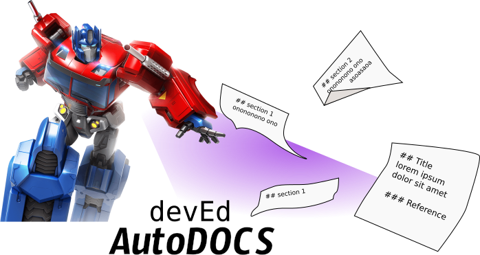

# AutoDocs


This repository contains scripts and resources to build automated reference documentation for various projects at Chainguard.

Autodocs uses [yamldocs](https://github.com/erikaheidi/yamldocs), a PHP cli tool to generate markdown documents based on YAML files.

Autodocs is developed and maintained by the Developer Education team at Chainguard.

## Requirements
To execute the scripts in this repository, you will need a PHP runtime environment with Composer.
Docker is also fine.

### Installation

Clone this repository and enter the application directory:

```shell
git clone git@github.com:chainguard-dev/deved-autodocs.git
cd deved-autodocs
```

Install Composer dependencies:

```shell
composer install
```

Then check that you're able to run yamldocs with:

```shell
./vendor/bin/yamldocs help
```

Finally, create a couple directories in your **workdir** to use as input and output paths:

```shell
mkdir workdir/yaml
mkdir workdir/markdown
```

## Manually Building Docs

### Melange Pipelines

First, make sure to pull into the **workdir** the melange `pipelines` directory from their repo.

```shell
cd ~
git clone https://github.com/chainguard-dev/melange.git
cp -R melange/pkg/build/pipelines deved-autodocs/workdir/yaml/
```
The script expects to find a directory structure like this:

```shell
workdir
├── markdown
│   └── melange-pipelines
│       ├── autoconf
│       ├── cmake
│       ├── meson
│       ├── split
│       ├── fetch.md
│       ├── git-checkout.md
│       ├── patch.md
│       └── strip.md
└── yaml
    └── pipelines
        ├── autoconf
        ├── cmake
        ├── meson
        ├── _meta
        ├── split
        ├── fetch.yaml
        ├── git-checkout.yaml
        ├── patch.yaml
        └── strip.yaml

```

The `build-pipelines-docs.sh` [script](scripts/build-pipelines-docs.sh) will go through the directories in **workdir/yaml/pipelines** and generate docs for every YAML found, saving the markdown files in **workdir/markdown/melange-pipelines**.
```shell
./scripts/build-pipelines-docs.sh
```

#### Generating Partial Docs

Example of how to manually generate one set of docs / update only a subfolder.
```shell
./vendor/bin/yamldocs build docs source=workdir/yaml/pipelines/autoconf output=workdir/markdown/autoconf
```